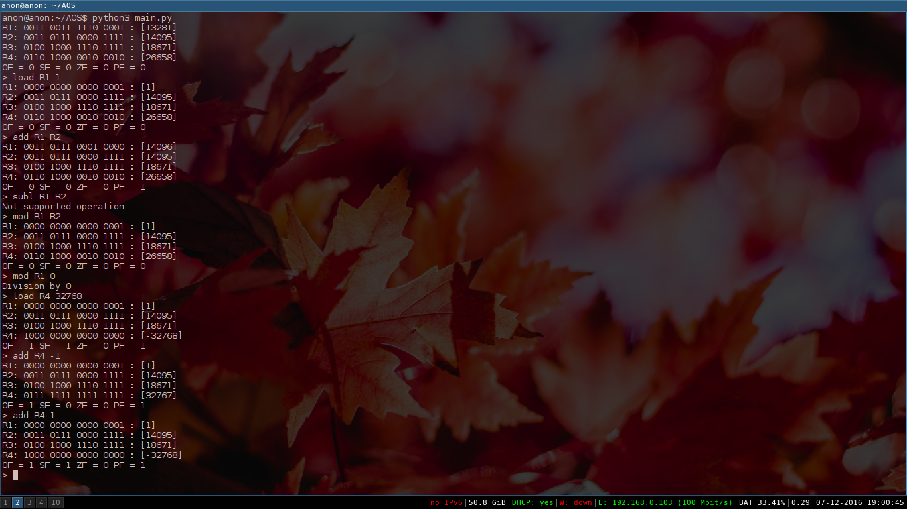

<h3> Description </h3>

Imitation of 16 bit processor with 4 registers

<h6>Supported operations</h5>
<ul>
	<li><b>load</b> RX RY </li>
	<li><b>add</b> RX RY </li>
	<li><b>mod</b> RX RY </li>
</ul>
RX - should be always one of 4 registers(R1-R4)
RY - can be either a register or an <b>INTEGER</b> number

<h6>Screenshot</h6>
